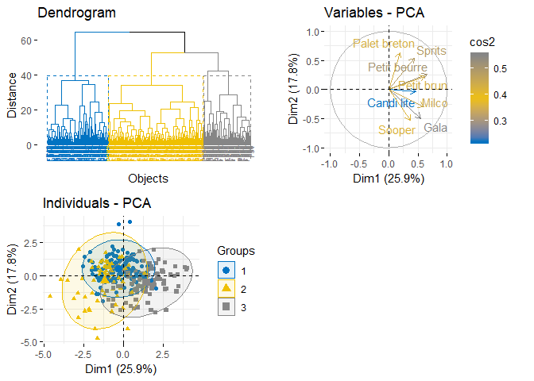

ClusteringR
===========

Its functionality includes exploratory data analysis, data segmentation and data visualization.It is designed to handle realistic data sets : hedonic data set and sensory data set. It makes use of several clustering methods as well as the implementation of partition-validity approach.

Finally, a graphical user interface is implemented with R shiny in order to propose a user friendly package.

Installation
------------

You can install the development version from [GitHub](https://github.com/) with:

``` r
install.packages("devtools")
devtools::install_github("BouzidiImen/ClusteringR")
```

Usage
-----

You can find below an overall look at how ClusteringR can be useful for your sensory analysis. \#\#\#Clustering : Diverse methods of clustering are available in the ClusteringR package :

'hierarchical','diana','kmeans','clara','pam','sota' and 'som'

``` r
library(ClusteringR)
# Create a clustering object  -------------------------------------------------
cl <- Clustering(t(hedo),ClustMeth='hierarchical',k=4,Hdismethod='euclidean',Hmethod="ward.D2",
                    Graph=F,VarCart=F,IndCart=F,ElbowP=F )
# get clusters
clusters=cl$classes

#Plot of elbow method , dendrogram , variables representation and individuals

plot_grid(cl$ElbowP, cl$dendrogram, cl$VarCart, cl$IndCart, hjust = 1, vjust = 1,
          scale = c(1, 1, 1, 1))
```



``` r
help("Clustering") # to see more information about the function of clustering 
```

Data available in the package
-----------------------------

-   senso: sensory data from a professional trial of 8 biscuits by 12 judges.
-   hedo: hedonic data from a trial of 8 biscuits by 294 customers.

``` r
#Usage 
library(ClusteringR)
S=senso # sensory data 
H=hedo # hedonic data
```

A User Friendly Package
-----------------------

Within the package you find a shiny application that demonstrate what the package does and make its use easier.

``` r
ClustShiny() #run shiny application
```


P.S:You can visit the following link to get a sneak peek on the package functionalities.

[Shiny application for the package](https://imenbouzidi.shinyapps.io/InterfaceForThepackage/)

Acknowledgement:
----------------

In preparation of my package, I had to take the help and guidance of my professor Ibtihel Rebhi, who deserves my deepest gratitude.
